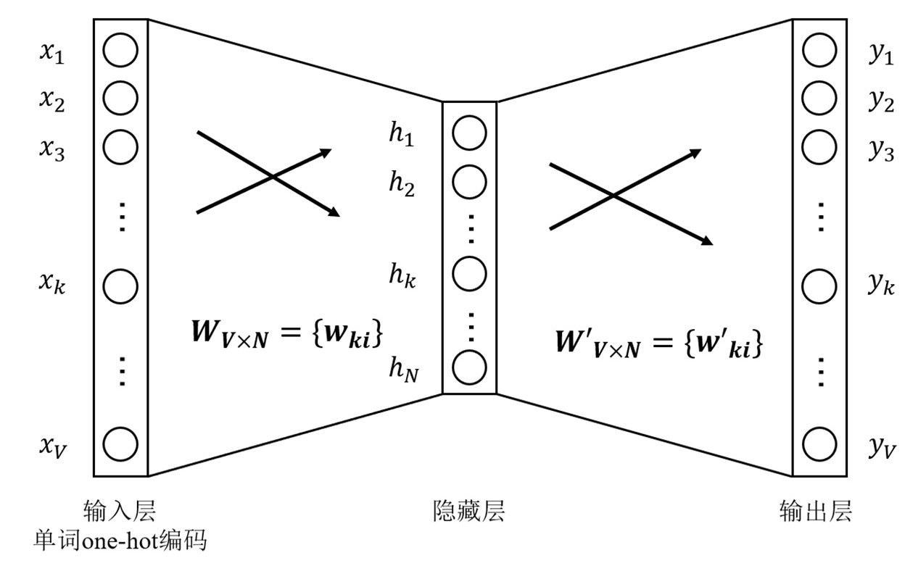
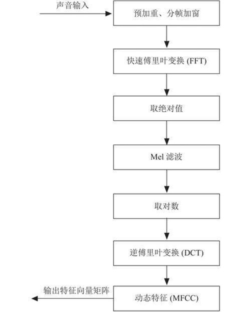
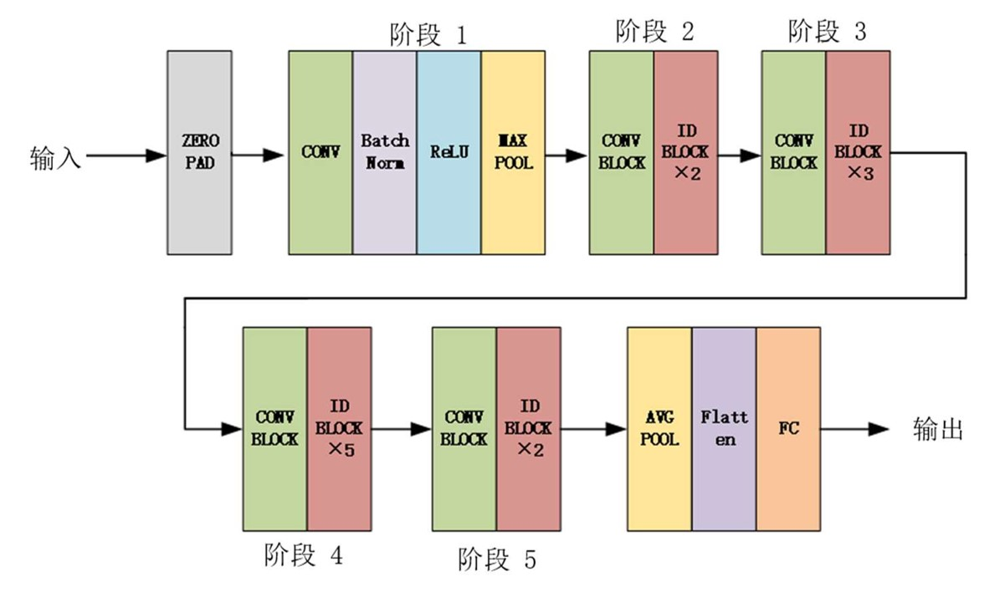
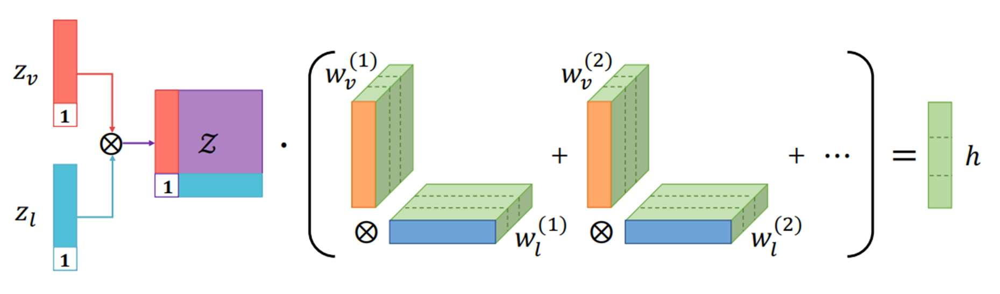
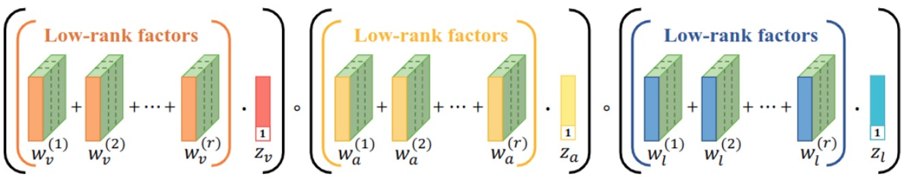
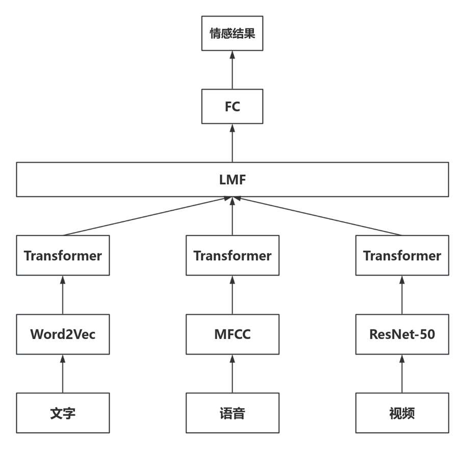

# Multi-model Emotion Recognition Based on Attention Mechanism

> Pytorch implementation for learning Multi-model Emotion Recognition Based on Attention Mechanism.

## Overview
### Preprocessing for text, audio and video

### Text preprocessing

Word2Vec word vector model text representation method solves these problems well. The model uses a large amount of text data for unsupervised training, generates dense word vectors, and performs contextual prediction tasks. Train the word vector of each word to contain its semantic meaning in the sentence.

### Audio preprocessing

In the field of audio recognition and speech processing, the Meir frequency cepstrum coefficient (MFCC) is a widely used characteristic method of sign extraction.

### Facial expression Preprocessing

The structure of the ResNet-50 consists of five stages: the first stage is mainly for the initial processing of the input size of 224×224 images; In the second to fifth stages, features are extracted by combining multiple convolution modules. Finally, a fully connected layer is connected to output the final features of the image.

### Overall Architecture for Low Rank Multimodal Fusion

The low rank fusion model achieves parallel decomposition of feature representation Z and weight tensor W, avoiding the need for single modal decomposition. The tedious process of creating high-dimensional feature representations using feature vectors greatly reduces computational complexity. Different modes are decoupled from each other. This means that the feature extraction and representation of each modality are independent of each other, and the corresponding parameters can be learned separately, making the method more flexible and scalable. In addition, low rank fusion methods are also differentiable and can optimize parameters through backpropagation, enabling the model to learn data features and patterns more efficiently during training. This not only improves the training speed of the model, but also makes it easier to adjust and optimize in practical applications, further enhancing its applicability and practicality.

### Experimental Model Structure 

  
The core of our proposed model are crossmodal transformer and crossmodal attention module.   
  
## Usage

### Prerequisites
- Python 3.7/3.8 or above
- [Pytorch (>=1.0.0) and torchvision](https://pytorch.org/)
- CUDA 10.0 or above

### Datasets

Data files (containing processed MOSI, MOSEI and IEMOCAP datasets) can be downloaded from [here](https://www.dropbox.com/sh/hyzpgx1hp9nj37s/AAB7FhBqJOFDw2hEyvv2ZXHxa?dl=0).
  
I personally used command line to download everything:
~~~~
wget https://www.dropbox.com/sh/hyzpgx1hp9nj37s/AADfY2s7gD_MkR76m03KS0K1a/Archive.zip?dl=1
mv 'Archive.zip?dl=1' Archive.zip
unzip Archive.zip
~~~~

### Run the Code

1. Create (empty) folders for data and pre-trained models:
~~~~
mkdir data pre_trained_models
~~~~

and put the downloaded data in 'data/'.

2. Command as follows
~~~~
python main.py [--FLAGS]
~~~~

Note that the defualt arguments are for unaligned version of MOSEI. For other datasets, please refer to Supplmentary.

### If Using CTC

Transformer requires no CTC module. However,  CTC module offers an alternative to applying other kinds of sequence models (e.g., recurrent architectures) to unaligned multimodal streams.

If you want to use the CTC module, plesase install warp-ctc from [here](https://github.com/baidu-research/warp-ctc).

The quick version:
~~~~
git clone https://github.com/SeanNaren/warp-ctc.git
cd warp-ctc
mkdir build; cd build
cmake ..
make
cd ../pytorch_binding
python setup.py install
export WARP_CTC_PATH=/home/xxx/warp-ctc/build
~~~~

